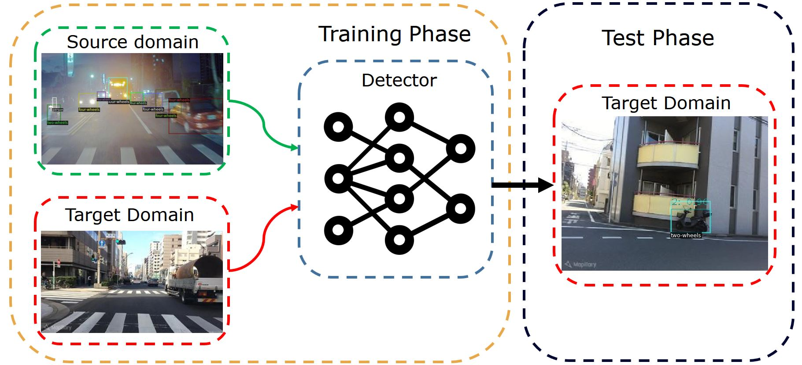
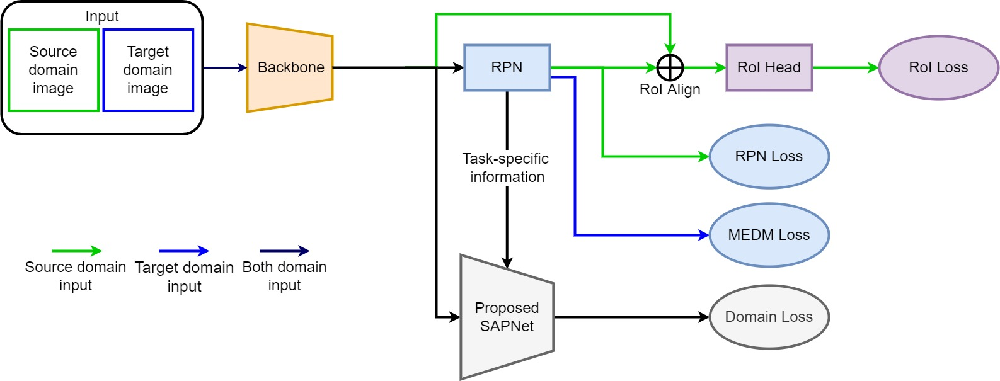

# A Detectron2 Implementation of SAPNetV2

## Overall Architecture

Overall framework of proposed method. The detector should be pretrained on the source domain, both domain data and detector including domain classifier are involved in the domain adaptation stage. In test phase, detector excluding domain classifier infers on target domain test set. Source domain data in the domain adaptation stage can be replaced with target-like source domain images which are source domain images with target domain style
generated by Cycle GAN.

## Training Framework

Detailed training framework of the proposed method, RPN and RoI loss are supervised loss of
normal faster rcnn. For each iteration, the source and target domain batches will be successively sent into the backbone network, and the next batch will be input only if the previous batch has finished computing. When the features are sent to the domain classifier, the domain labels will be given according to which domain the features come from.

## Environment
```
python 3.8.11
pytorch 1.9.0 (conda)
torchvision 0.10.0 (conda)
detectron2 0.5+cu111 (pip)
tensorboard 2.6.0 (pip)
opencv-python (pip)
pycocotools (pip)
```
### Directory Structre
The directory structure should be as follows:

```bash
SAPNetV2/
├── configs/        # configuration files
├── datasets/       # datasets
├── detections/     # main implementation
|   ├── da_heads/   # domain classfier, MS-CAM
|   ├── data/       # data registeration
|   ├── evaluation/ # poscal voc metric
|   ├── layers/     # intermediate neural layer
|   ├── meta_arch/  # faster rcnn
|   ├── modeling/   # rpn, MEDM Loss
|   ├── hook.py     # evaluation extension
|   └── trainer.py  # supervised and unsupervised domain adaptation trainer, grad-cam
|
├── tools/          # train object detector
|   └── train_net.py
├── pretrained      # pretrained models
├── outputs/        # training logs
├── test_images/    # inference outputs
└── scripts/        # useful scripts
```

## Data Preparation

1. make your dataset format to voc or coco, or [other format](https://detectron2.readthedocs.io/en/latest/tutorials/builtin_datasets.html) that detectron2 supports
2. register your dataset at [detection/data/register.py](./detection/data/register.py)
3. test set format must be VOC becuase we use VOC metric to evaluate result

```python
# VOC format
dataset_dir = $YOUR_DATASET_ROOT
classes = ('person', 'two-wheels', 'four-wheels') # dataset classes
years = 2007
# to find image list at $YOUR_DATASET_ROOT/ImaegSets/Main/{$split}.txt, only "train", "test", "val", "trainval"
split = 'train'
# call your dataset by this
meta_name = 'itri-taiwan-416_{}'.format(split)
# call register_pascal_voc to register
register_pascal_voc(meta_name, dataset_dir, split, years, classes)
```

## Hyper Parameters
Full configuration explanation is [here](./configs/README.md), hyper parameter we can tuned:
1. `MODEL.DA_HEAD.WINDOW_SIZES` and `MODEL.DA_HEAD.WINDOW_STRIDES`, both are parameter of spatial pooling in domain classfier
2. `MODEL.DA_HEAD.LOSS_WEIGHT`, domain classifier loss weight, [0, 1.0]
3. `MODEL.DA_HEAD.TARGET_ENT_LOSS_WEIGHT`, entropy loss weight, [0, 1.0]
4. `MODEL.DA_HEAD.TARGET_DIV_LOSS_WEIGHT`, diversity loss weight, [-1.0, 0]

### The Best Perfomance of Hyper Paramenters
source domain images are target-like source domain images which are generated by Cycle GAN.
| Scenarios | Domain Classifier Loss Weight | Entropy Loss Weight | Diversity Loss Weight | mAP |
|:-------------:|:-------------:|:-------------:|:-------------:|:-------------:|
| cityscapes -> foggy cityscapes | 0.6 | 1.0 | 0.2 | 49.63 |
| sim10k -> cityscapes | 0.1 | 0.8 | 0.3 | 49.48 |
| kitti -> cityscapes | 0.1 | 1.0 | 0.05 | 45.79 |

1. you can check these training logs in the `pretrained/*-best/` using `tensorboard --logdir $LOG_PATH`
2. `pretrained/*-baseline` store the model pretrained with source domain

## Usages
1. Train a normal faster rcnn using source domain data (source domain only)
2. Train whole model including domain calssfier using baseline model weight
3. [scripts](./scripts) stores sample scripts for three domain adaptation scenarios
<details>
<summary>basic usage</summary>

* train a model
``` bash
python tools/train_net.py --config-file $CONFIG_FILE_PATH --num-gpus 1
```
* test the model
``` bash
# update MODEL.WEIGHTS by command line
python tools/train_net.py --config-file $CONFIG_FILE_PATH --num-gpus 1 --eval-only MODEL.WEIGHTS $MODEL_WEIGHT_PATH
```
* predict boxes on the test set
``` bash
python tools/train_net.py --config-file $CONFIG_FILE_PATH --num-gpus 1 --test-images MODEL.WEIGHTS $MODEL_WEIGHT_PATH  MODEL.ROI_HEADS.SCORE_THRESH_TEST 0.75
```
</details>

## Script Usage
Please use these scripts at `SAPNetV2/`
```bash
# or sh scripts/../....sh
..../SAPNetV2$ source scripts/../....sh
``` 
* `scripts/*/train_source_only.sh` is to train object detector using source domain data only, output directory is under `outputs/`
* `scripts/*/train_sapv2.sh` is to train object detector with domain adaptation, output directory is under `outputs/`
* `scripts/*/test_img.sh` is to predict boxes on the test set, output directory is under `test_images/`
* `scripts/*/eval.sh` is to evaluate object detector with and without domain adaptation on the test set
* `scripts/*/attention_mask.sh` is to visualize spatial attention mask of domain classfier, output directory is under `test_images/`
* `scripts/*/grad_cam_domain_calssifier.sh` is to visualize class activation map of domain classifier using grad cam, output directory is under `test_images/`
* `scripts/*/grad_cam_object_detection.sh` is to visualize class activation map of object detector using grad cam, output directory is under `test_images/`

## Ablation
Configuration files for ablation are under `configs/*/ablation/`
* `scripts/*/cyclegan.sh` is to train baseline method using souce domain images with target domain style generated by cycle gan
* `scripts/*/medm.sh` is to train baseline method with MEDM loss which is implemented in [here](detection/modeling/rpn.py)
* `scripts/*/mscam.sh` is to train baseline method with MS-CAM which is implemented in [here](detection/da_heads/mscam.py)

# Acknowledgement
* [SapNetDA](https://isrc.iscas.ac.cn/gitlab/research/domain-adaption)
* [Detectron2](https://github.com/facebookresearch/detectron2)
* [Grad-CAM.pytorch](https://github.com/yizt/Grad-CAM.pytorch)
* Professor Yie Tarng Chen, lab
classmates [Tyson](https://github.com/tysonwang26) and Bo Cheng Lee

